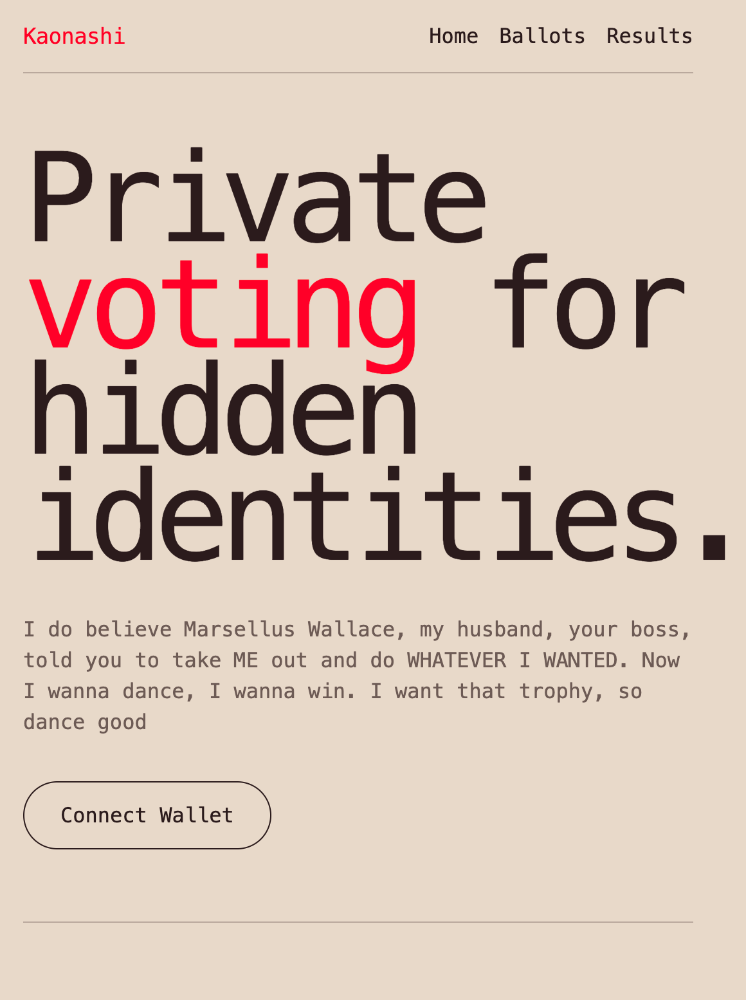
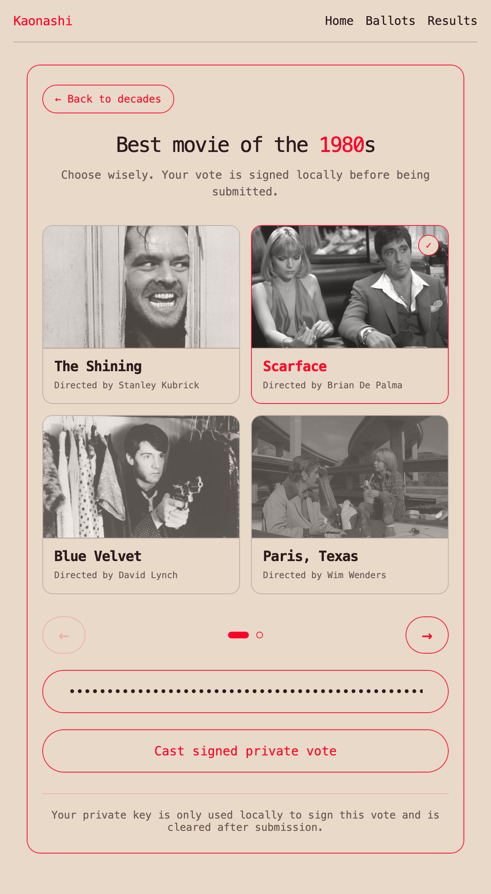
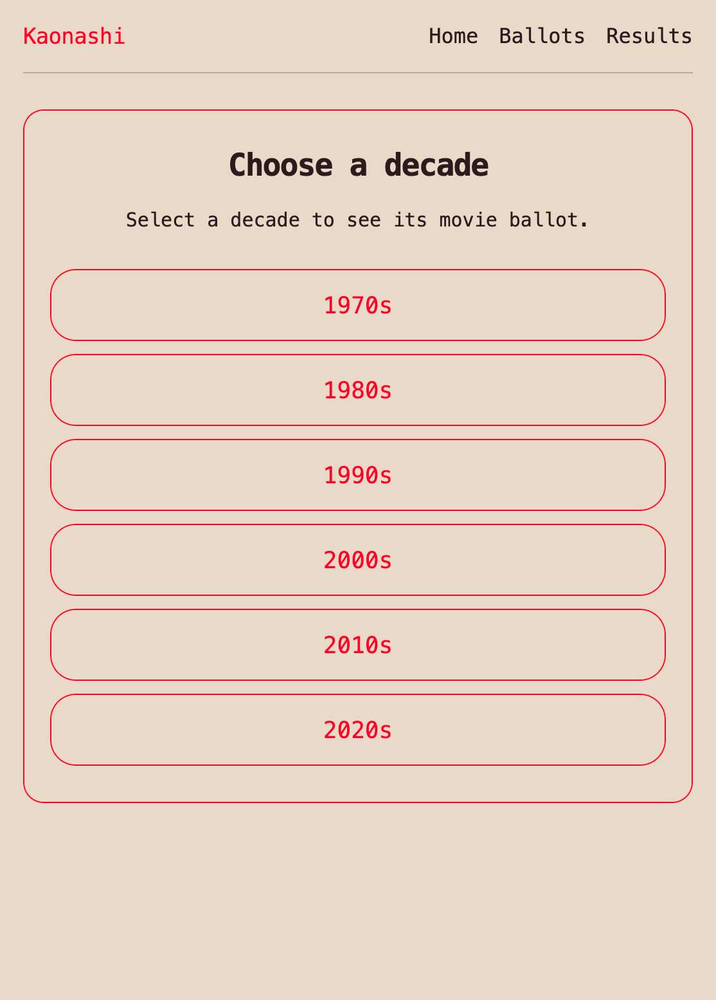

<a id="readme-top"></a>

<!-- PROJECT LOGO -->

<h3 align="center">Kaonashi</h3>

<!-- TABLE OF CONTENTS -->

<details>
  <summary>Table of Contents</summary>
  <ol>
    <li>
      <a href="#about-the-project">About The Project</a>
      <ul>
        <li><a href="#built-with">Built With</a></li>
      </ul>
    </li>
    <li>
      <a href="#getting-started">Getting Started</a>
      <ul>
        <li><a href="#prerequisites">Prerequisites</a></li>
      </ul>
    </li>
    <li>
      <a href="#usage">Usage</a>
      <ul>
        <li><a href="#1-start-the-solana-local-validator">1. Start the Solana Local Validator</a></li>
        <li><a href="#2-build-and-deploy-the-smart-contract">2. Build and Deploy the Smart Contract</a></li>
        <li><a href="#3-start-the-api">3. Start the API</a></li>
        <li><a href="#4-start-the-frontend">4. Start the Frontend</a></li>
      </ul>
    </li>
    <li><a href="#contributing">Contributing</a></li>
  </ol>
</details>

<!-- ABOUT THE PROJECT -->

## About The Project


Kaonashi is an encrypted voting system built on Solana, designed around movie ballots grouped by decades. Instead of sending a plaintext vote to the blockchain, the frontend represents the selected movie as a one-hot vector, encrypts it, generates the required proofs, and sends the encrypted submission through the API to the smart contract.

The smart contract never learns which movie a voter selected. It only verifies that the encrypted vote is valid, rejects tampered submissions, prevents double voting, and updates the encrypted tally. When the election ends, the final encrypted results can be decrypted off-chain and the winning movie can be submitted back to the chain.

This project was developed as the Final Project of my Computer Science degree at Universidade da Beira Interior. Check out the [report](./report.pdf) for a full technical breakdown of the cryptographic design, voting flow and system architecture.

<p align="center">
  
  &nbsp;
  
  &nbsp;
  
</p>

<p align="right">(<a href="#readme-top">back to top</a>)</p>

### Built With

These are some of the tools, frameworks and cryptographic mechanisms used to build Kaonashi.

* `Rust`: the main programming language used across the smart contract, API and frontend.
* `Solana`: the blockchain used to store ballots, voter records, encrypted tallies and final results.
* `Anchor`: the framework used to build and test the Solana smart contract.
* `ElGamal`: the encryption scheme used to encrypt votes and support homomorphic tallying.
* `Zero-Knowledge Proofs`: used to prove that an encrypted vote is well-formed without revealing the selected option.
* `Homomorphic Tallying`: used to add encrypted votes directly into the encrypted tally.
* `Trunk`: used to build and serve the Rust/WASM frontend.
* `Rust/WASM Frontend`: used to create the voting interface and prepare encrypted vote submissions.
* `Rust API`: used as the coordination layer between the frontend and the Solana program.

<p align="right">(<a href="#readme-top">back to top</a>)</p>

<!-- GETTING STARTED -->

## Getting Started

To run Kaonashi locally, you need to start four components in order: the Solana local validator, the smart contract, the API, and the frontend. Follow the steps below.

### Prerequisites

To build and run this project you will need to have `Rust`, `cargo`, the `Solana CLI`, `Anchor` and `Trunk` installed.

* Solana CLI and test validator — follow the official [installation guide](https://docs.solanalabs.com/cli/install).
* Anchor — follow the official [installation guide](https://www.anchor-lang.com/docs/installation).
* Trunk — install with:

  ```sh
  cargo install trunk
  ```

<p align="right">(<a href="#readme-top">back to top</a>)</p>

<!-- USAGE EXAMPLES -->

## Usage

**Disclaimer:** This setup runs the entire system locally against a Solana test validator. It is intended for development, testing and academic demonstration purposes, not for production deployment.

### 1. Start the Solana Local Validator

```sh
cd kaonashi-smart-contract
solana-test-validator --reset
```

Keep this terminal running in the background. The local validator acts as the blockchain where the ballots, voter records and encrypted tallies are stored.

<p align="right">(<a href="#readme-top">back to top</a>)</p>

### 2. Build and Deploy the Smart Contract

In a new terminal:

```sh
cd kaonashi-smart-contract
anchor build
anchor deploy
```

This compiles the Anchor program and deploys it to the running local validator. The smart contract is responsible for initializing ballots, registering voters, accepting encrypted votes, updating the encrypted tally and storing the final winner.

<p align="right">(<a href="#readme-top">back to top</a>)</p>

### 3. Start the API

In a new terminal:

```sh
cd kaonashi-api
cargo run --bin main
```

The API acts as the bridge between the frontend and the smart contract. It handles vote submission, encrypted vote processing, batching-related operations, result queries and communication with the Solana blockchain.

<p align="right">(<a href="#readme-top">back to top</a>)</p>

### 4. Start the Frontend

In a new terminal:

```sh
cd kaonashi_frontend
trunk serve --open
```

This builds and serves the frontend, opening it automatically in your default browser. From there, users can connect, choose a decade ballot, vote for a movie and submit an encrypted vote to the system.

<p align="right">(<a href="#readme-top">back to top</a>)</p>

<!-- CONTRIBUTING -->

